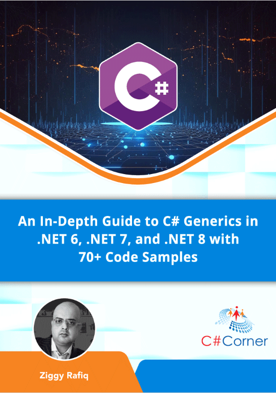

# An In-Depth Guide to C# Generics in .NET 6, .NET 7 and .NET 8  with 70+ Code Samples 
## With Extensive Code Demonstrations, Unlocking the Power of C# Generics: A Comprehensive Journey through .NET 6, .NET 7, and .NET 8
## By Ziggy Rafiq

## INTRODUCTION
* Introduction to Generics in C#
* Exploring the Depth of C# Generics
* Generics Collections in .NET 6/7/8
* Navigating Covariance and Contravariance in .NET 7 and .NET 8
* Generic Constraints and Best Practices
* Generic Delegates and Events
* Exploring Generics in .NET 8
* Design Patterns and Generic Programming
* Debugging and Performance Optimization
* Case Studies and Real-world Applications
* Future Trends and Best Practices

## Author
### Ziggy Rafiq
- **Technical Lead Developer, C# Corner (MVP 🏅, VIP⭐️, Public Speaker🎤), Mentor, and Trainer**
- **C# Corner MVP, VIP, Speaker, Chapter Lead UK**
- Mentor and Trainer with solid experience in System Architecture for over 19 years
- Link to [**Ziggy Rafiq Blog**](https://blog.ziggyrafiq.com)
- Link to [**Ziggy Rafiq Website**](https://ziggyrafiq.com)
* [**Please remember to subscribe to My YouTube channel**](https://www.youtube.com/)
* [**Please remember to follow me on LinkedIn**](https://www.linkedin.com/in/ziggyrafiq/)
* [**Please remember to connect with me on C# Corner**](https://www.c-sharpcorner.com/members/ziggy-rafiq)
* [**Please remember to follow  me on Twitter/X**](https://twitter.com/ziggyrafiq)
* [**Please remember to follow  me on Instagram**](https://www.instagram.com/ziggyrafiq/)
* [**Please remember to follow  me on Facebook**](https://www.facebook.com/ziggyrafiq)
